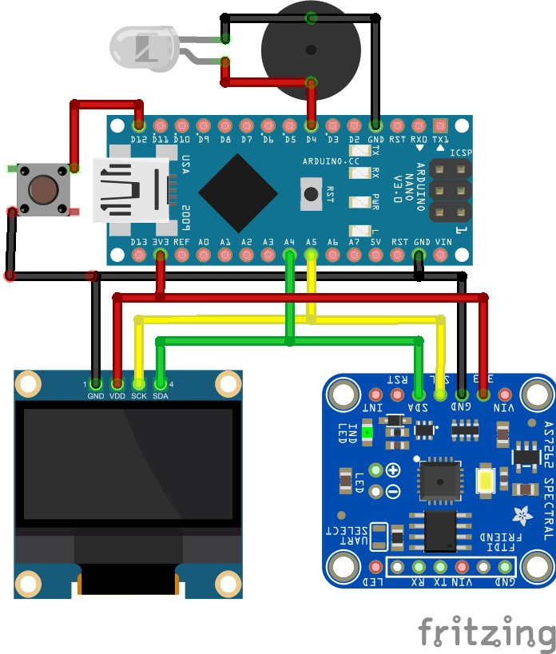
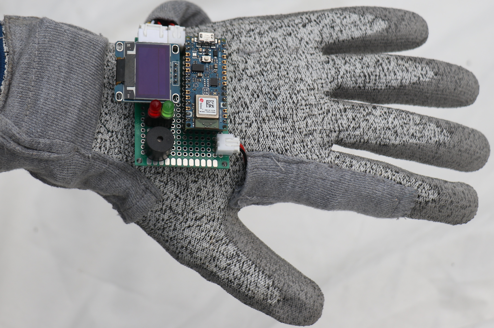

# SLOVE : Smart Fluorescence-Based Glove for Simultaneous Harvesting and Ripeness Sorting of Crystal Guava

SLOVE (Smart Glove Fluorescence) is a wearable sensing system designed to assist farmers in determining the ripeness of crystal guava fruits in a fast, non-destructive, and real-time manner. The device integrates a spectral sensor (AS7265x) with three illumination sources (UV, Visible, and Near Infrared) to capture optical signatures of the fruit. These spectral characteristics are correlated with fruit sweetness (°Brix) and ripeness level using chemometric or machine learning models. The glove-based design allows farmers to harvest and sort fruit ripeness simultaneously, improving efficiency in agricultural operations.

  
  

## Key Features
- Non-destructive fruit ripeness detection
- Wearable smart glove design
- Multi-spectral sensing using AS7265x
- Three illumination sources : UV LED, Visible LED, Near Infrared LED
- Real-time measurement
- OLED display output
- Portable and battery-powered system

## How the System Works
- The user places the sensor near the fruit surface.
- UV, Visible, and NIR LEDs illuminate the fruit sequentially.
- The spectral sensor records the reflected/fluorescent light.
- The spectral data is processed using a Brix prediction model.
- The predicted ripeness level is displayed on the OLED screen.

## Schematic Design

  
  

| Component | Function |
|-----------|-----------|
| Arduino Nano | Main microcontroller |
| AS7262 Spectral Sensor | Spectral measurement |
| UV LED | Fluorescence excitation |
| OLED Display | Display measurement results |
| Push Button | Trigger measurement |
| Battery | Power supply |

## Code Pgrogram
The program begins by importing the required libraries for communication, sensor reading, display output, and machine learning prediction.

| Library | Description | Download |
|-------|-------------|----------|
| Wire.h | Used for I2C communication between microcontroller and sensor | Built-in Arduino Library |
| Adafruit_AS726x | Library to control the AS726x spectral sensor | https://github.com/adafruit/Adafruit_AS726x |
| Adafruit_GFX | Graphics library used for drawing text and graphics on displays | https://github.com/adafruit/Adafruit-GFX-Library |
| Adafruit_SSD1306 | OLED display driver library | https://github.com/adafruit/Adafruit_SSD1306 |
| RF_jambu.h | Random Forest model for guava ripeness classification | Included in this repository |
| RF_jambu_brix.h | Random Forest model for Brix prediction | Included in this repository |
