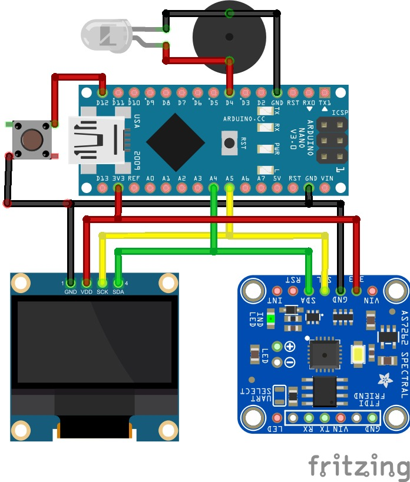
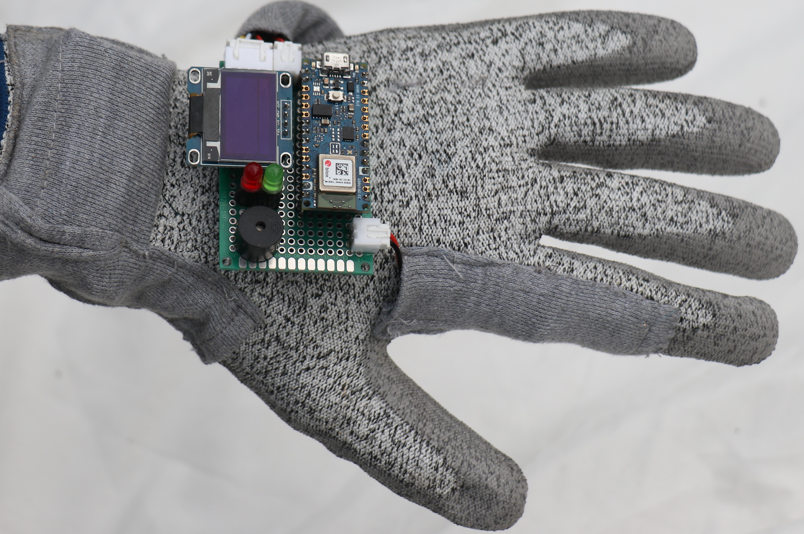

# SLOVE : Smart Fluorescence-Based Glove for Simultaneous Harvesting and Ripeness Sorting of Crystal Guava

SLOVE (Smart Glove Fluorescence) is a wearable sensing system designed to assist farmers in determining the ripeness of crystal guava fruits in a fast, non-destructive, and real-time manner. The device integrates a spectral sensor (AS7265x) with three illumination sources (UV, Visible, and Near Infrared) to capture optical signatures of the fruit. These spectral characteristics are correlated with fruit sweetness (°Brix) and ripeness level using chemometric or machine learning models. The glove-based design allows farmers to harvest and sort fruit ripeness simultaneously, improving efficiency in agricultural operations.

  
  

<h2>Project Contribution</h2>

In this project, I served as the <b>Project Leader</b> and was responsible for
the overall technical development of the Smart Fluorescence-Based Glove (SLOVE).
My role included designing the system architecture, selecting hardware
components, integrating the AS726x spectral sensor with the Arduino platform,
and developing the embedded software required for data acquisition and
processing.

I designed and assembled the electronic hardware, including sensor integration,
LED illumination control, power management, and OLED display interfacing.
Additionally, I developed the Arduino firmware used to collect spectral data,
control the measurement sequence, and display prediction results in real time.

I was also responsible for the machine learning implementation, including data
collection, preprocessing, model training, validation, and deployment of the
Random Forest models for ripeness classification and Brix prediction. The final
machine learning models were converted into embedded C/C++ libraries and
integrated into the microcontroller, enabling standalone operation without the
need for external computing devices.

As project leader, I coordinated project planning, task allocation, prototype
development, testing, and system validation to ensure that the device met the
intended objectives of simultaneous harvesting and ripeness sorting of crystal
guava fruits.

## How the System Works
- The user places the sensor near the fruit surface.
- UV, Visible, and NIR LEDs illuminate the fruit sequentially.
- The spectral sensor records the reflected/fluorescent light.
- The spectral data is processed using a Brix prediction model.
- The predicted ripeness level is displayed on the OLED screen.

## Schematic Design

  
  

| Component | Function |
|-----------|-----------|
| Arduino Nano | Main microcontroller |
| AS7262 Spectral Sensor | Spectral measurement |
| UV LED | Fluorescence excitation |
| OLED Display | Display measurement results |
| Push Button | Trigger measurement |
| Battery | Power supply |

## Code Pgrogram
The program begins by importing the required libraries for communication, sensor reading, display output, and machine learning prediction.

| Library | Description | Download |
|-------|-------------|----------|
| Wire.h | Used for I2C communication between microcontroller and sensor | Built-in Arduino Library |
| Adafruit_AS726x | Library to control the AS726x spectral sensor | https://github.com/adafruit/Adafruit_AS726x |
| Adafruit_GFX | Graphics library used for drawing text and graphics on displays | https://github.com/adafruit/Adafruit-GFX-Library |
| Adafruit_SSD1306 | OLED display driver library | https://github.com/adafruit/Adafruit_SSD1306 |
| RF_jambu.h | Random Forest model for guava ripeness classification | Included in this repository |
| RF_jambu_brix.h | Random Forest model for Brix prediction | Included in this repository |

you can check my project in Youtube bellow
- https://youtu.be/ajxup2CWTZ0?si=leHLe59VPfrUehhh
- https://youtu.be/c_wbpiDT6qc?si=Xc2bwbwPms-WVfRy
